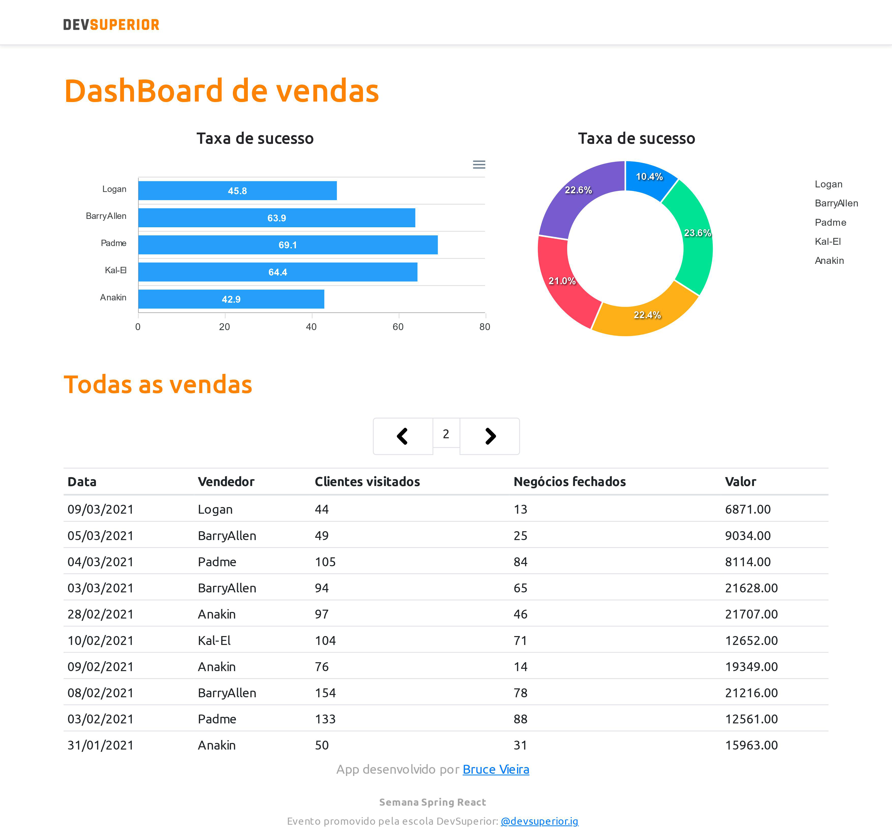

#  Semana Spring React - SDS 3.0

<h4 align="center">Sales Dashboard</h4>
<p align="center">
  
</p>

## 🛠 Technologies

The following technologies was used to build this application:

- Spring boot
- java 11
- React
- TypeScript
- Docker

## 🎲 Installation

To execute the frontend of this project, you need to own: Nodejs and Yarn installed for configure all dependencies.

```shell
- Clone repository:
$ cd "Preference directory"
$ git clone https://github.com/Deimos177/sds3.git

- Install frontend dependencies:
$ yarn

- Execute the application:
$ yarn start

- Open your browser on:
http://localhost:3333/
```

- To install dependencies from backend:
```
$ maven 

$ java 11 or greater

$ Open in you preferred IDE and start project

To execute via terminal:

$ cd backend

$ mvn spring-boot:run
```

To execute the project on docker container, please, follow the steps below.
```
$ cd backend

Generate .jar package

$ mvn clean package

Create docker image

$ docker image build -f Dockerfile -t sds3 .

Create docker container

$ docker run -d --name sds3-backend -p 8080:8080 sds3
```

## ✅ Author

**Bruce Vieira**